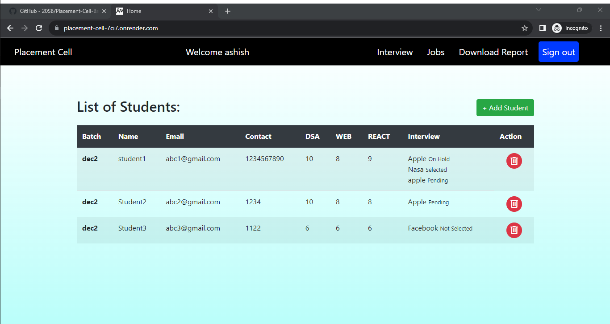

# NodeJS-Placement-Cell
 <h1 align="center">Placement Cell  📝</h1> 

 🖊️ An interface for coding ninjas placement cell to keep records of students and schedule interviews with different companies  
     This App built using <a href="https://ejs.co/">EJS</a>, <a href="https://www.mongodb.com/">MongoDB</a>, <a href="https://expressjs.com/">ExpressJs</a>, <a href="https://nodejs.org/en/">NodeJs</a> and <a href="http://www.passportjs.org/">PassportJS</a>

## Table of contents

- [Features](#Features)
- [Screenshot](#Screenshots)
- [Built with](#built-with)
- [Author](#author)
- [Setup](#Setup)
- [Run](#Run)
- [Deploy Link](#deployed-link)

## Features

- Sign up / Sign in forms for employees
- Add a new student to the list of students
- Allocate and schedule interview with different companies and update their result status
- View list of Students allocated for specific interview and update their result status
- Download reports of students in csv format
- Visit available jobs in India

## Screenshots

- Sign Up
    

- Sign In
    

- Student Page
    

  - Add student
    

- Interview Page
    

- Schedule Interview
    

  - Jobs Page
    

### Built with

- NodeJs
- Express
- MongoDB
- CSS
- JavaScript

## Author

- Github - [Subha Biswal](https://github.com/20SB)

## Setup

Run `npm install` to install required dependencies

## Run

Run `npm start`, open localhost:8000 in browser to run the program

## Deployed Link

-[Placement Cell](https://placement-cell-7ci7.onrender.com)